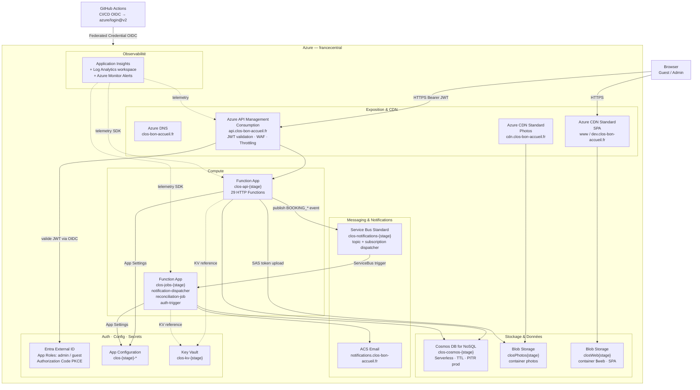
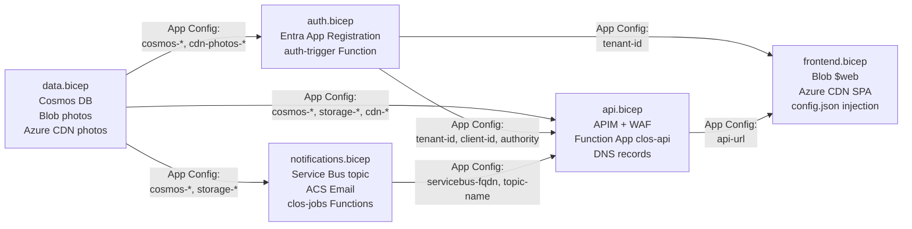
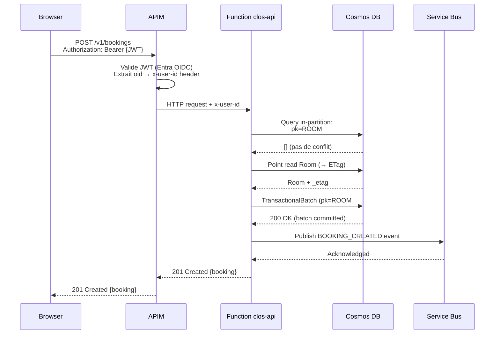
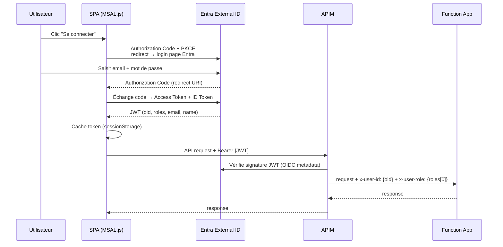

# 03-A — Infrastructure Azure & déploiement

> **Source of Truth pour l'infrastructure cible.** Ce fichier remplace
> `specs/03-infrastructure.md` (archive AWS, conservée pour référence de migration).
> Région principale : **`francecentral`** (Paris). Aucune contrainte de région
> secondaire — Azure CDN et APIM gèrent les certificats TLS automatiquement.
> Décisions D1–D6 : `docs/migration-azure/02-mapping-services.md`.

---

## 3.1 — Organisation du repository

```
clos-bon-accueil/
├── shared-types/          # @clos/shared-types — types, DTO, dates, events
├── frontend/              # React 18 SPA (Vite)
│   ├── src/
│   │   ├── api/           # client.ts, hooks.ts
│   │   ├── auth/          # LoginScreen, AuthProvider (MSAL.js v3)
│   │   ├── screens/       # écrans migrés du prototype
│   │   ├── ui/            # primitives partagées
│   │   └── App.tsx
│   ├── public/
│   │   └── config.json    # injecté à deploy-time par az CLI (§3.4.1)
│   └── vite.config.ts
├── backend/               # Azure Functions v4 (isolated worker, Node.js 20)
│   ├── src/
│   │   ├── data/          # repository.ts (interface) + repository.cosmos.ts (impl PM2)
│   │   ├── api/           # http.ts, deps.ts, logger.ts, schemas/
│   │   ├── handlers/      # une Function = un fichier (migration PM4)
│   │   └── shared/        # identifiers.ts
│   └── scripts/
│       └── seed.ts
├── infra/
│   ├── bicep/             # ← cible Azure (PM1)
│   │   ├── main.bicep
│   │   ├── modules/
│   │   │   ├── data.bicep
│   │   │   ├── auth.bicep
│   │   │   ├── notifications.bicep
│   │   │   ├── api.bicep
│   │   │   └── frontend.bicep
│   │   └── parameters/
│   │       ├── dev.bicepparam
│   │       └── prod.bicepparam
│   └── lib/               # CDK stacks AWS (archive — ne pas modifier)
├── docs/
│   └── migration-azure/   # audit AWS, mapping services, ce fichier
├── specs/                 # spécifications fonctionnelles (source de vérité métier)
└── package.json           # npm workspaces racine
```

**Conventions de nommage Azure** :
- Ressources : `clos-{resource}-{stage}` (ex. `clos-cosmos-dev`)
- Resource group : `rg-clos-bon-accueil-{stage}`
- Région : `francecentral`

---

## 3.2 — Modules Bicep

L'orchestrateur `infra/bicep/main.bicep` déploie **5 modules** dans l'ordre
décrit au §3.11. Chaque module équivaut à une stack CDK.

### 3.2.1 — Découplage strict entre modules (anti-cycle)

**Règle absolue** : les modules Bicep ne partagent pas de valeurs via des
outputs ARM natifs (qui créent des dépendances figées). Chaque module écrit
ses outputs dans **Azure App Configuration** sous la convention :
`clos-{stage}-{category}-{key}`.

Les modules consommateurs lisent ces clés au déploiement (via `az appconfig
kv show`) ou les Functions les lisent au runtime via les App Settings.

| Clé App Configuration | Module émetteur | Consommateurs |
|---|---|---|
| `clos-{stage}-data-cosmos-endpoint` | data.bicep | api.bicep, notifications.bicep |
| `clos-{stage}-data-cosmos-database` | data.bicep | api.bicep, notifications.bicep |
| `clos-{stage}-data-cosmos-container` | data.bicep | api.bicep, notifications.bicep |
| `clos-{stage}-data-storage-account` | data.bicep | api.bicep |
| `clos-{stage}-data-photos-container` | data.bicep | api.bicep |
| `clos-{stage}-data-cdn-photos-domain` | data.bicep | frontend.bicep (config.json) |
| `clos-{stage}-auth-tenant-id` | auth.bicep | api.bicep, frontend.bicep |
| `clos-{stage}-auth-client-id` | auth.bicep | api.bicep, frontend.bicep |
| `clos-{stage}-auth-authority` | auth.bicep | api.bicep, frontend.bicep |
| `clos-{stage}-notifications-servicebus-fqdn` | notifications.bicep | api.bicep |
| `clos-{stage}-notifications-topic-name` | notifications.bicep | api.bicep |
| `clos-{stage}-api-url` | api.bicep | frontend.bicep (config.json) |

**Secrets** dans Key Vault `clos-kv-{stage}` (créé en prérequis — §3.11) :

| Secret Key Vault | Usage |
|---|---|
| `admin-email` | notification-dispatcher |
| `acs-connection-string` | notification-dispatcher |
| `acs-from-address` | notification-dispatcher |

Les Function Apps referencent ces secrets via la syntaxe Key Vault reference
dans leurs App Settings : `@Microsoft.KeyVault(VaultName=clos-kv-{stage};SecretName=admin-email)`.

### 3.2.2 — `data.bicep`

Ressources :
- **Cosmos DB for NoSQL** `clos-cosmos-{stage}` :
  - Database : `clos-bon-accueil`, container : `clos-bon-accueil-{stage}`.
  - Partition key : `/pk`.
  - Indexing policy : automatique (tous chemins inclus).
  - TTL : activé (`defaultTtl: -1` — respect de la propriété `ttl` par item).
  - PITR : Continuous 30 days en prod, désactivé en dev (cf. §3.3).
  - `removalPolicy` équivalent : `Delete` en dev, tag `doNotDelete` en prod.
  - Throughput : **Serverless** (pay per RU — adapté au faible volume).
- **Azure Blob Storage** `closphotos{stage}` :
  - Container `photos` (privé, accès via Managed Identity ou SAS).
  - Lifecycle : tier Cool après 90 jours.
  - CORS : PUT depuis l'origin frontend (cf. §3.3 `allowedOrigins`).
  - Encryption : SSE Microsoft-managed.
- **Azure CDN Standard Microsoft** profil `clos-cdn-{stage}` :
  - Endpoint photos : `cdn.{domain}.clos-bon-accueil.fr` (ou `cdn.clos-bon-accueil.fr` en prod).
  - Origin : Blob Storage `photos` (via Managed Identity — équivalent OAC).
  - HTTPS uniquement, TLS 1.2.
  - Certificat custom domain géré automatiquement par Azure CDN (Let's Encrypt).

Écrit dans App Configuration les clés listées §3.2.1.

### 3.2.3 — `auth.bicep`

Ressources :
- **Entra External ID** — App Registration `clos-bon-accueil-{stage}` :
  - Type : Single-page application (MSAL.js, implicit grant **désactivé**,
    Authorization Code + PKCE activé).
  - Redirect URIs : `https://{domain}.clos-bon-accueil.fr/`, `http://localhost:5173/`.
  - `signInAudience: AzureADandPersonalMicrosoftAccount` ou tenant spécifique.
  - App Roles : `admin` (value: `admin`) et `guest` (value: `guest`).
  - Token validity : access 1h, refresh 24h (configurable dans Entra).
  - **Pas de mot de passe app** (SPA public client).
- **Function App** `clos-jobs-{stage}` (partielle — 1 fonction ici) :
  - `auth-trigger` : HTTP Function déclenchée par Entra post-sign-up (ou
    déclenchée via App Service trigger — cf. PM3).
  - System-Assigned Managed Identity.
  - RBAC : `Cosmos DB Built-in Data Contributor` sur le container scope.
  - App Settings : `COSMOS_ENDPOINT`, `COSMOS_DATABASE`, `COSMOS_CONTAINER`,
    `STAGE`, `LOG_LEVEL`.

Écrit dans App Configuration : `auth-tenant-id`, `auth-client-id`, `auth-authority`.

### 3.2.4 — `notifications.bicep`

Ressources :
- **Service Bus Standard** namespace `clos-notifications-{stage}` :
  - Topic `clos-notifications-{stage}` (ou un namespace partagé dev/prod pour
    réduire le coût à ~10€/mois — cf. FinOps §3.9).
  - Subscription `dispatcher` liée à `clos-jobs-{stage}` (Service Bus trigger).
- **Azure Communication Services Email** (resource partagée ou par stage) :
  - Domaine email `notifications.clos-bon-accueil.fr`.
  - Records DNS DKIM et DMARC créés dans Azure DNS.
  - **⚠️ Vérifier disponibilité ACS Email en `francecentral` (D3).**
- **Function App** `clos-jobs-{stage}` (complète) :
  - `notification-dispatcher` : ServiceBus trigger sur la subscription `dispatcher`.
  - `reconciliation-job` : Timer trigger NCRONTAB `0 0 1 * * *` (01:00:00 UTC).
  - `auth-trigger` : HTTP (déclaré en auth.bicep, App déployée ici).
  - Memory : plan Consumption (Y1) partagé avec `clos-api-{stage}`.
  - System-Assigned Managed Identity.
  - RBAC assignments :
    - `Cosmos DB Built-in Data Contributor` sur container scope.
    - `Azure Service Bus Data Receiver` sur la subscription.
    - `Azure Service Bus Data Sender` sur le topic (reconciliation publie aussi).
    - `Key Vault Secrets User` sur `clos-kv-{stage}`.
    - `App Configuration Data Reader` sur l'App Configuration.
  - App Settings : `COSMOS_ENDPOINT`, `COSMOS_DATABASE`, `COSMOS_CONTAINER`,
    `STAGE`, `LOG_LEVEL`, `SERVICEBUS_FQDN`, `SERVICEBUS_TOPIC`,
    + Key Vault references pour `ACS_CONNECTION_STRING`, `ACS_FROM_ADDRESS`,
    `ADMIN_EMAIL`.
- **Azure Monitor Alert** → Action Group email admin (`admin-email` KV secret)
  pour les alertes ops (remplace SNS alarms topic).

Écrit dans App Configuration : `notifications-servicebus-fqdn`, `notifications-topic-name`.

### 3.2.5 — `api.bicep`

Ressources :
- **Azure API Management** (Consumption tier) `clos-apim-{stage}` :
  - Custom domain : `api.{stage}.clos-bon-accueil.fr` (ou `api.clos-bon-accueil.fr` prod).
  - Certificat TLS auto-géré (Azure-managed via Azure DNS).
  - JWT validation policy : valide Bearer JWT émis par Entra (`authority` + `audience`).
  - Throttling : burst 100, rate 50 req/s par subscription (APIM product).
  - Access logs : Log Analytics workspace.
  - **Azure WAF policy** attachée à l'APIM :
    - `AzureManagedRulesOWASPCRS3.2` (équivalent `AWSManagedRulesCommonRuleSet`)
    - `AzureManagedRulesKnownBadInputs` (équivalent `AWSManagedRulesKnownBadInputsRuleSet`)
    - Rate-based rule : 2000 req / 5 min par IP.
  - CORS : origines explicites depuis le paramètre `allowedOrigins` (§3.3).
- **Function App** `clos-api-{stage}` :
  - 29 HTTP Functions (une par route API — cf. `specs/02-api-contract.md`).
  - Runtime : Node.js 20, isolated worker model (arm64).
  - Plan : Consumption (Y1).
  - System-Assigned Managed Identity.
  - RBAC assignments :
    - `Cosmos DB Built-in Data Contributor` sur container scope.
    - `Storage Blob Data Contributor` sur container `photos` (upload SAS).
    - `Azure Service Bus Data Sender` sur le topic.
    - `App Configuration Data Reader`.
    - `Key Vault Secrets User` sur `clos-kv-{stage}`.
  - App Settings communs : `COSMOS_ENDPOINT`, `COSMOS_DATABASE`,
    `COSMOS_CONTAINER`, `STAGE`, `LOG_LEVEL`, `TENANT_ID`.
  - App Settings selon la fonction (cf. §3.12 pour la liste exhaustive).
- **Azure DNS** zone `clos-bon-accueil.fr` :
  - Enregistrements A/CNAME pour : `api.{stage}`, `cdn.{stage}`, `www`, apex.
  - CNAME pour DKIM ACS Email.

Écrit dans App Configuration : `api-url`.

### 3.2.6 — `frontend.bicep`

Ressources :
- **Azure Blob Storage** `closweb{stage}` :
  - Container `$web` (static website hosting activé).
  - Upload de `frontend/dist/` via `az storage blob upload-batch`.
- **Azure CDN Standard Microsoft** endpoint SPA :
  - Origin : Blob `$web`.
  - Error responses 403/404 → `/index.html` (SPA fallback via règles CDN).
  - Alias domaine : `{stage}.clos-bon-accueil.fr` (dev) ou `www.clos-bon-accueil.fr` (prod).
  - HTTPS uniquement, TLS 1.2.
- **Injection de `config.json`** :
  - Généré à deploy-time en lisant les clés App Configuration.
  - Uploadé dans `$web/config.json` via `az storage blob upload`.
  - Le frontend le lit au démarrage (`fetch('/config.json')`).

---

## 3.3 — Configuration par stage

La configuration de stage est définie dans les fichiers Bicep parameters
(`dev.bicepparam`, `prod.bicepparam`) et dans `main.bicep`.

```bicep
// infra/bicep/parameters/dev.bicepparam
using '../main.bicep'

param stage = 'dev'
param location = 'francecentral'
param domain = 'dev.clos-bon-accueil.fr'
param apiDomain = 'api.dev.clos-bon-accueil.fr'
param cdnPhotosDomain = 'cdn.dev.clos-bon-accueil.fr'
param rootDomain = 'clos-bon-accueil.fr'
param pointInTimeRecovery = false
param seedMockBookings = true
param appInsightsSamplingPercentage = 10
param logRetentionDays = 7
param allowedOrigins = ['http://localhost:5173', 'https://dev.clos-bon-accueil.fr']
param cosmosCapacityMode = 'Serverless'
param functionAppSkuName = 'Y1'   // Consumption
param apimSkuName = 'Consumption'
```

```bicep
// infra/bicep/parameters/prod.bicepparam
using '../main.bicep'

param stage = 'prod'
param domain = 'www.clos-bon-accueil.fr'
param apiDomain = 'api.clos-bon-accueil.fr'
param cdnPhotosDomain = 'cdn.clos-bon-accueil.fr'
param pointInTimeRecovery = true
param seedMockBookings = false
param appInsightsSamplingPercentage = 100
param logRetentionDays = 30
param allowedOrigins = ['https://www.clos-bon-accueil.fr']
```

---

## 3.4 — Frontend : intégration avec le backend

### 3.4.1 — Configuration runtime

Le frontend lit sa configuration depuis `/config.json`, **injecté à deploy-time**
par `frontend.bicep` en lisant les clés App Configuration résolues :

```json
{
  "apiBaseUrl": "https://api.clos-bon-accueil.fr/v1",
  "tenantId": "xxxxxxxx-xxxx-xxxx-xxxx-xxxxxxxxxxxx",
  "clientId": "xxxxxxxx-xxxx-xxxx-xxxx-xxxxxxxxxxxx",
  "authority": "https://xxxxxxxx.ciamlogin.com/xxxxxxxx-xxxx-xxxx-xxxx-xxxxxxxxxxxx/v2.0",
  "cdnDomain": "cdn.clos-bon-accueil.fr",
  "stage": "prod"
}
```

**Mapping de migration** (Cognito → Entra) :

| Ancienne clé (Amplify) | Nouvelle clé (MSAL) | Source |
|---|---|---|
| `userPoolId` | `tenantId` | App Configuration `auth-tenant-id` |
| `userPoolClientId` | `clientId` | App Configuration `auth-client-id` |
| `region` | `authority` | App Configuration `auth-authority` |

### 3.4.2 — Auth côté frontend (MSAL.js v3)

Remplace `@aws-amplify/auth@6`. Package : `@azure/msal-browser@3` +
`@azure/msal-react@2`.

**Flow d'authentification** : Authorization Code + PKCE (SPA, standard OIDC).
Pas de Hosted UI Entra à configurer — MSAL.js gère la redirection vers la
page de login Entra External ID et le retour via redirect URI.

```typescript
// frontend/src/auth/AuthProvider.tsx — configuration MSAL
const msalConfig: Configuration = {
  auth: {
    clientId: config.clientId,
    authority: config.authority,
    redirectUri: window.location.origin,
  },
  cache: { cacheLocation: 'sessionStorage' },
};
```

**Claims JWT Entra (vs Cognito)** :
- `oid` → userId (remplace `sub` Cognito).
- `roles` → tableau des App Roles (ex. `["admin"]`) — remplace `cognito:groups`.
- `email` → email de l'utilisateur.
- `name` → displayName.

Le `AuthProvider` expose `{ account, isLoading, signIn, signOut }`.
`account.localAccountId` === `oid` === `userId` dans Cosmos DB.

### 3.4.3 — Migration du prototype (écrans, styles, hooks)

Inchangé par rapport à `specs/03-infrastructure.md §3.4.3–3.4.7`.
Lire ces sections pour les règles impératives de migration visuelle
(styles.css verbatim, design tokens, routeur stack, photo upload).

---

## 3.5 — DNS et certificats

### 3.5.1 — Prérequis manuels (hors Bicep)

1. Achat du domaine `clos-bon-accueil.fr` chez un registrar.
2. **Création de la zone Azure DNS** `clos-bon-accueil.fr` (dans `api.bicep`
   ou manuellement en prérequis si la zone doit exister avant les modules).
3. Mise à jour des NS du registrar pour pointer vers Azure DNS.
4. Attendre la propagation DNS (`dig NS clos-bon-accueil.fr`).

### 3.5.2 — Sous-domaines créés par Bicep

| Enregistrement DNS | Pointe vers | Module |
|---|---|---|
| `www.clos-bon-accueil.fr` | Azure CDN SPA prod | frontend.bicep |
| `clos-bon-accueil.fr` (apex) | redirect 301 → `www.` via CDN rule | frontend.bicep |
| `dev.clos-bon-accueil.fr` | Azure CDN SPA dev | frontend.bicep |
| `api.clos-bon-accueil.fr` | APIM prod | api.bicep |
| `api.dev.clos-bon-accueil.fr` | APIM dev | api.bicep |
| `cdn.clos-bon-accueil.fr` | Azure CDN photos prod | data.bicep |
| `cdn.dev.clos-bon-accueil.fr` | Azure CDN photos dev | data.bicep |

### 3.5.3 — Certificats TLS

**Aucune gestion manuelle.** Azure CDN Standard Microsoft et Azure API
Management provisionnent automatiquement les certificats Let's Encrypt
pour les custom domains déclarés dans Bicep.

**Avantage vs AWS** : plus de `CertsStack` ni de contrainte `us-east-1` pour
CloudFront. Un seul déploiement par stage sans région secondaire.

---

## 3.6 — Observabilité

### 3.6.1 — Logs structurés

Toutes les Azure Functions loggent en **JSON structuré** via le SDK
`applicationinsights` (npm). Le package `@azure/monitor-opentelemetry`
est l'alternative OpenTelemetry-native.

```typescript
// backend/src/api/logger.ts — post-PM4
import appInsights from 'applicationinsights';

appInsights.setup(process.env.APPLICATIONINSIGHTS_CONNECTION_STRING)
  .setAutoCollectRequests(true)
  .setAutoCollectDependencies(true)
  .start();

export const client = appInsights.defaultClient;
export const logger = {
  info: (msg: string, props?: object) =>
    client.trackTrace({ message: msg, severity: 1, properties: props }),
  error: (msg: string, props?: object) =>
    client.trackTrace({ message: msg, severity: 3, properties: props }),
};
```

Rétention Log Analytics : selon `logRetentionDays` dans le bicepparam
(7j dev, 30j prod).

### 3.6.2 — Métriques custom

Via `appInsights.defaultClient.trackMetric()`. Namespace implicite = resource
Application Insights. Métriques à émettre (inchangées par rapport aux specs) :
- `BookingCreated` (count)
- `BookingConflict` (count) — sur 409 dans la création
- `RoomDeleted` (count) + propriété `cancelledBookings`
- `NotificationDispatched` (count) + propriété `eventType`
- `ReconciliationConflictsDetected` (count)

### 3.6.3 — Alertes Azure Monitor

Dans `notifications.bicep`, configure les **Azure Monitor Metric Alerts**
(remplace les alarmes CloudWatch + SNS alarms topic) — toutes notifient
l'Action Group email `clos-alerts-{stage}` (adresse = `admin-email` KV secret) :

- Function errors (exceptions) > 5 sur 5 min — par Function App.
- APIM 5XX response rate > 1% sur 10 min.
- Cosmos DB server-side errors > 0 sur 5 min.
- Metric `BookingConflict` > 20 sur 1 jour (anomalie business).
- Metric `ReconciliationConflictsDetected` > 0 (n'importe quelle exécution).

### 3.6.4 — Distributed tracing

Application Insights collecte automatiquement le tracing distribué entre APIM,
Function Apps et Cosmos DB via le `correlation-id` HTTP header. Sampling
configuré dans `appInsightsSamplingPercentage` (10% dev, 100% prod).

---

## 3.7 — Sécurité

### 3.7.1 — Managed Identity (least-privilege RBAC)

**Règle absolue** : aucune Function App n'a de credentials en clair (pas de
connection string Cosmos DB, pas de clé de compte Storage). Tout passe par
**System-Assigned Managed Identity** + RBAC assignments.

| Resource | Role Azure | Managed Identity |
|---|---|---|
| Cosmos DB container `clos-bon-accueil-{stage}` | `Cosmos DB Built-in Data Contributor` | `clos-api`, `clos-jobs` |
| Blob Storage container `photos` | `Storage Blob Data Contributor` | `clos-api` |
| Blob Storage container `photos` | `Storage Blob Data Reader` | CDN origin (Managed Identity CDN) |
| Service Bus topic `clos-notifications-{stage}` | `Azure Service Bus Data Sender` | `clos-api`, `clos-jobs` (reconciliation) |
| Service Bus subscription `dispatcher` | `Azure Service Bus Data Receiver` | `clos-jobs` |
| App Configuration | `App Configuration Data Reader` | `clos-api`, `clos-jobs` |
| Key Vault `clos-kv-{stage}` | `Key Vault Secrets User` | `clos-api`, `clos-jobs` |

**Granularité** : chaque RBAC assignment est scoped au container/topic/secret
concerné — jamais à la subscription ou au resource group entier.

Le rôle CI/CD GitHub Actions est une **Federated Credential distincte** (§3.8.4)
qui n'est jamais utilisée par les Function Apps.

### 3.7.2 — Secrets et paramètres

- **Aucun secret en clair dans le code ni dans Git.**
- Configs non-sensibles → **Azure App Configuration** (cf. §3.2.1).
- Secrets → **Azure Key Vault** `clos-kv-{stage}` :
  - `admin-email` — email du propriétaire.
  - `acs-connection-string` — connection string ACS Email.
  - `acs-from-address` — adresse FROM des emails transactionnels.
- Key Vault References dans les App Settings des Function Apps :
  `@Microsoft.KeyVault(VaultName=clos-kv-{stage};SecretName=admin-email)`.

### 3.7.3 — Chiffrement

- Cosmos DB : chiffrement au repos Microsoft-managed (SSE).
- Blob Storage : SSE Microsoft-managed (AES-256).
- En transit : HTTPS uniquement, TLS 1.2 sur tous les endpoints.
- Log Analytics : chiffrement Microsoft-managed.

### 3.7.4 — Audit

**Microsoft Defender for Cloud** (basique, niveau Free) activé sur la
souscription pour les recommandations de sécurité. Azure Activity Log
(équivalent CloudTrail) actif par défaut — configurer un diagnostic setting
vers le Log Analytics workspace.

### 3.7.5 — RGPD

Données nominatives (email, nom, notes de séjour) hébergées en `francecentral`
(Paris) — conformité résidence UE garantie.

Obligations fonctionnelles (inchangées — cf. `specs/02-api-contract.md §2.4`) :
- Droit à l'effacement : `DELETE /v1/me`.
- Droit à la portabilité : `GET /v1/me/export`.
- Rétention des logs selon `logRetentionDays` (7j dev, 30j prod).
- Aucune donnée personnelle dans les métriques Application Insights.

---

## 3.8 — Pipeline CI/CD

### 3.8.1 — `ci.yml` (déclenché sur PR)

1. Checkout, setup Node 20, `npm ci` à la racine.
2. `npm run lint --workspaces`.
3. `npm run typecheck --workspaces`.
4. `npm run test --workspaces` (vitest — Cosmos DB Emulator pour intégration).
5. `az deployment group validate --template-file infra/bicep/main.bicep
   --parameters infra/bicep/parameters/dev.bicepparam` (vérifie le template).

### 3.8.2 — `deploy-dev.yml` (déclenché sur merge `main`)

1. Toutes les étapes de `ci.yml`.
2. `azure/login@v2` avec la Federated Credential dev (§3.8.4).
3. `az deployment group create ... --parameters dev.bicepparam`.
4. `npm run build --workspace=frontend` → `frontend/dist/`.
5. `az storage blob upload-batch --destination '$web' ...` (upload SPA).
6. Génération et upload de `config.json` (depuis App Configuration).
7. Smoke tests post-deploy :
   - `GET https://api.dev.clos-bon-accueil.fr/v1/health` → 200.
   - `GET https://dev.clos-bon-accueil.fr/` → 200.
   - Test E2E Playwright headless : login dev-admin → vérif dashboard.

### 3.8.3 — `deploy-prod.yml` (déclenché sur tag `v*.*.*`)

Identique à dev mais :
- Paramètre `prod.bicepparam`.
- **Approbation manuelle GitHub Environments** avant le déploiement Bicep.
- Smoke tests pointent sur `prod`.
- GitHub Release automatique avec changelog.

### 3.8.4 — Federated Credential GitHub (OIDC)

Crée manuellement dans Entra (une-shot, §3.11) ou via Bicep `OidcApp.bicep` :

- App Registration dédié `clos-github-actions` dans le tenant Entra.
- Federated Credential (pas de secret) :
  - dev : `repo:{org}/CBA-repo:ref:refs/heads/main`
  - prod : `repo:{org}/CBA-repo:ref:refs/tags/v*`
- Rôle Azure : `Contributor` sur `rg-clos-bon-accueil-{stage}` + droits
  `Microsoft.Authorization/roleAssignments/write` pour les RBAC assignments
  Bicep (scope resource group).

Configuré dans GitHub Actions secrets : `AZURE_CLIENT_ID`, `AZURE_TENANT_ID`,
`AZURE_SUBSCRIPTION_ID` (pas de secret, juste des IDs publics).

### 3.8.5 — Stratégie de tests E2E

Inchangée — cf. `specs/03-infrastructure.md §3.8.5` (3 scénarios Playwright :
guest, admin, conflit). Requiert PM4 (Functions) + P10 (écrans).

---

## 3.9 — Coût estimé Azure

Hypothèses : gîte 12 chambres, ~10 000–20 000 appels API/mois, < 50 MAU,
~100 emails/mois, 2 stages (dev + prod), `francecentral`.

| Service | dev | prod | Total HT/mois |
|---|---|---|---|
| Azure Functions (Consumption) | €0 | €0 | **€0** (1M exec. offertes) |
| API Management (Consumption) | €0 | €0 | **€0** (1M calls offertes) |
| Cosmos DB (Serverless) | ~€0.05 | ~€0.20 | **~€0.25** |
| Blob Storage (LRS hot) | ~€0.01 | ~€0.12 | **~€0.13** |
| Azure CDN Standard | ~€0 | ~€0.40 | **~€0.40** (5 GB offerts) |
| ACS Email | €0 | €0 | **€0** (100 emails/jour offerts) |
| Service Bus Standard | ← namespace partagé → | | **~€10** (base tier fixe) |
| App Configuration (Standard) | €0 (Free) | ~€1.20 | **~€1.20** |
| Key Vault | ~€0 | ~€0 | **~€0** (< 10k opérations) |
| Entra External ID | €0 | €0 | **€0** (< 50k MAU offerts) |
| Application Insights + Monitor | €0 | €0 | **€0** (5 GB/mois offerts) |
| Azure DNS | — | ~€0.90 | **~€0.90** |
| **TOTAL HT** | | | **~€13/mois** |
| **TOTAL TTC (20% TVA)** | | | **~€15.50/mois** |

**Optimisation** : remplacer Service Bus Standard par Azure Storage Queue
(~€0/mois) réduit la facture à **~€3/mois HT**. Trade-off : perte du pub/sub
(acceptable avec 1 seul consumer).

Configurer Azure Cost Management :
- Alerte à 20€/mois (80% du budget).
- Hard cap notification à 50€/mois.

---

## 3.10 — Roadmap post-MVP (hors scope)

Inchangée par rapport aux specs — SMS, multi-photos, favoris, statistiques,
React Router, i18n, MFA Entra. Azure-specifique : remplacer Storage Queue
par Service Bus si un second consumer est ajouté.

---

## 3.11 — Checklist de bring-up (1er déploiement Azure)

Étapes à suivre **dans cet ordre strict**.

### Phase 0 — Prérequis manuels (humain)

1. Achat du domaine `clos-bon-accueil.fr` chez un registrar.
2. **Création de la souscription Azure** (ou sous-souscription Azure Management Groups).
3. Création des **resource groups** :
   - `rg-clos-bon-accueil-dev`
   - `rg-clos-bon-accueil-prod`
4. Configuration **Azure Cost Management** + alertes budget (20€, 50€).
5. **Tenant Entra External ID** : créer ou configurer le tenant.
6. **App Registrations Entra** (1 par stage) :
   - Créer App Roles `admin` (value: `admin`) et `guest` (value: `guest`).
   - Configurer redirect URIs MSAL.
7. Vérifier disponibilité **ACS Email en `francecentral`** (D3). Si indisponible :
   utiliser `swedencentral` et documenter la décision data residency.
8. Créer **Azure DNS zone** `clos-bon-accueil.fr` manuellement (ou via Bicep
   si le registrar est configuré en avance).
9. Mise à jour des **NS du registrar** → Azure DNS. Attendre propagation.
10. Créer **Key Vault** `clos-kv-dev` et `clos-kv-prod`, peupler les secrets :
    - `admin-email` = email réel du propriétaire.
    - `acs-connection-string` = (après création ACS).
    - `acs-from-address` = `no-reply@notifications.clos-bon-accueil.fr`.
11. Créer **Azure Communication Services** resource (domaine email + DKIM/DMARC).
12. Créer **App Configuration** `clos-appconfig-dev` (Free tier) et
    `clos-appconfig-prod` (Standard).
13. Créer **Federated Credential GitHub** `clos-github-actions` dans Entra
    (OIDC — cf. §3.8.4). Configurer les secrets `AZURE_CLIENT_ID`,
    `AZURE_TENANT_ID`, `AZURE_SUBSCRIPTION_ID` dans GitHub.

### Phase 1 — Déploiement infra (ordre Bicep)

14. `az deployment group create --resource-group rg-clos-bon-accueil-dev
    --template-file infra/bicep/modules/data.bicep
    --parameters stage=dev location=francecentral ...`
15. Idem `auth.bicep`.
16. Idem `notifications.bicep`.
17. Idem `api.bicep` (crée APIM + Function App `clos-api` vide).
18. Build frontend : `npm run build --workspace=frontend`.
19. `az storage blob upload-batch --destination '$web' ...`
20. Idem `frontend.bicep` (CDN + `config.json`).

### Phase 2 — Seed et premier utilisateur

21. `npm run seed --workspace=backend -- --stage dev` :
    - Crée le `HouseConfig` singleton.
    - Crée les 12 Rooms.
    - Crée les 13 Bookings mock (dev uniquement).
22. **Premier admin** : Portail Entra External ID → « Inviter un utilisateur »
    → assigner App Role `admin`.
23. Vérifier le `auth-trigger` : le Function `auth-trigger` doit créer l'item
    `User` dans Cosmos DB au premier login.
24. Premier login sur `https://dev.clos-bon-accueil.fr/` via MSAL redirect.

### Phase 3 — Smoke tests

25. Login → home s'affiche.
26. `useRooms()` → 12 chambres.
27. Créer un booking bout en bout (tunnel 4 étapes).
28. Mode admin → dashboard charge.
29. Supprimer une chambre → cascade + email ACS envoyé.

### Phase 4 — Déploiement prod

30. Répéter phases 1-3 avec `--parameters prod.bicepparam`.
31. Seed prod : `npm run seed --workspace=backend -- --stage prod` (pas de mock bookings).
32. Premier merge `main` → vérifier `deploy-dev.yml`.
33. Premier tag `v0.1.0` → vérifier `deploy-prod.yml` (approbation manuelle).

---

## 3.12 — Variables d'environnement Azure Functions

Injectées par Bicep depuis App Configuration + Key Vault references.
**Aucune valeur hardcodée dans le code handler.**

| Function scope | App Settings |
|---|---|
| Toutes les Functions `clos-api` | `COSMOS_ENDPOINT`, `COSMOS_DATABASE`, `COSMOS_CONTAINER`, `STAGE`, `LOG_LEVEL`, `TENANT_ID`, `APPLICATIONINSIGHTS_CONNECTION_STRING` |
| Functions créant/modifiant des Bookings | + `SERVICEBUS_FQDN`, `SERVICEBUS_TOPIC` |
| Functions manipulant des photos | + `STORAGE_ACCOUNT`, `PHOTOS_CONTAINER`, `CDN_PHOTOS_DOMAIN` |
| Functions Entra (auth-trigger) | `COSMOS_ENDPOINT`, `COSMOS_DATABASE`, `COSMOS_CONTAINER`, `STAGE`, `LOG_LEVEL` |
| `notification-dispatcher` | `COSMOS_ENDPOINT`, `COSMOS_DATABASE`, `COSMOS_CONTAINER`, `STAGE`, `LOG_LEVEL`, `ACS_CONNECTION_STRING` *(KV ref)*, `ACS_FROM_ADDRESS` *(KV ref)*, `ADMIN_EMAIL` *(KV ref)* |
| `reconciliation-job` | `COSMOS_ENDPOINT`, `COSMOS_DATABASE`, `COSMOS_CONTAINER`, `STAGE`, `LOG_LEVEL`, `SERVICEBUS_FQDN`, `SERVICEBUS_TOPIC` |

**Note** : `COSMOS_ENDPOINT` seul suffit pour l'authentification Cosmos DB —
pas de clé d'accès. L'accès est authentifié via Managed Identity
(`DefaultAzureCredential` du SDK `@azure/cosmos`).

---

## 3.A — Vues d'architecture

### 3.A.1 — Architecture générale (tous les services Azure)



### 3.A.2 — Ordre de déploiement et dépendances Bicep



### 3.A.3 — Flux d'une requête HTTP (création de booking)



### 3.A.4 — Flux d'authentification (MSAL.js → Entra → APIM)


